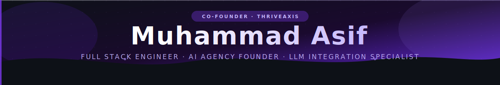

<div align="center">

<!-- Header Banner -->


<!-- Typing SVG -->


<br/>

<!-- Contact & Social Badges -->
<a href="mailto:asif1122se@gmail.com">
  
</a>
<a href="https://wa.me/923084075270">
  
</a>
<a href="https://www.linkedin.com/in/muhammad-asif-1122se/">
  
</a>

<br/><br/>


</div>

---

## `$ whoami`

```typescript
const asif: CoFounder & FullStackEngineer = {
  name:        "Muhammad Asif",
  role:        "Co-Founder & Lead Engineer @ ThriveAxis",
  email:       "asif1122se@gmail.com",
  phone:       "+92 308 4075270",
  linkedin:    "linkedin.com/in/muhammad-asif-1122se",

  company: {
    name:      "ThriveAxis",
    type:      "AI-Powered Full Stack Agency",
    focus:     "We build production-grade AI SaaS products end-to-end",
    services:  ["LLM Integration", "SaaS Architecture", "AI Automation", "Product Engineering"],
    hiring:    true,
    openToClients: true,
  },

  superpower:  "I don't just build features — I architect entire AI products.\n" +
               "Schema design, LLM pipelines, billing, auth, infra — owned start to finish.",

  currentFocus: [
    "Scaling ThriveAxis to serve global AI SaaS clients",
    "Production RAG pipelines and document intelligence",
    "Multi-tenant SaaS with Supabase + Next.js",
    "AI cost optimization and observability",
  ],

  stack: {
    ai:       ["OpenAI GPT-4o", "Anthropic Claude", "LangChain", "pgvector", "Pinecone"],
    frontend: ["Next.js 14", "React 18", "TypeScript", "Tailwind CSS", "shadcn/ui"],
    backend:  ["Node.js", "NestJS", "PostgreSQL", "Supabase", "Firebase"],
    billing:  ["Stripe", "Usage-based metering", "Webhook lifecycle management"],
    devops:   ["Vercel", "AWS", "Docker", "GitHub Actions", "Zero-downtime CI/CD"],
  },
};
```

---

## 🚀 ThriveAxis — What We Build

<div align="center">

> **ThriveAxis** is an AI-powered full stack agency. We architect and ship complete SaaS products — auth, database, AI pipeline, billing, and infrastructure — for founders and teams who want to move fast without cutting corners.

</div>

<table>
  <tr>
    <td width="50%" align="center">
      <strong>🤝 We Work With</strong><br/><br/>
      Startups building AI-first products<br/>
      Founders who need a technical co-builder<br/>
      Teams that want to integrate LLMs into existing SaaS<br/>
      Enterprises modernising with AI automation
    </td>
    <td width="50%" align="center">
      <strong>📦 We Deliver</strong><br/><br/>
      Complete SaaS products from zero to launch<br/>
      Production-grade RAG and LLM pipelines<br/>
      Multi-tenant architectures that scale<br/>
      Stripe billing wired to your backend
    </td>
  </tr>
</table>

---

## 🧠 What I Actually Build

<table>
  <tr>
    <td width="50%" valign="top">

### 🤖 AI Integration & LLM Engineering
Production AI — not demos:
- **RAG Pipelines** — semantic chunking, re-ranking, hybrid search
- **Streaming Interfaces** — SSE and WebSocket-backed LLM streaming
- **Document Intelligence** — PDF/DOCX parsing, embeddings, knowledge bases
- **OpenAI & Anthropic APIs** — GPT-4o, Claude 3.5, function calling, tool use
- **Vector Search** — pgvector, Pinecone, similarity scoring
- **Cost Efficiency** — token budgeting, caching, model routing

    </td>
    <td width="50%" valign="top">

### 🏗️ Multi-Tenant SaaS Architecture
Schemas that don't collapse at scale:
- **Workspace Isolation** — Row Level Security at the Postgres level
- **Supabase Backends** — Auth, RLS, Storage, Edge Functions
- **Data Partitioning** — tenant-scoped schemas, audit trails
- **Role-Based Access Control** — org-level permission systems
- **Scalable Schema Design** — migrations, zero-downtime deploys
- **Multi-region ready** — read replicas, connection pooling

    </td>
  </tr>
  <tr>
    <td width="50%" valign="top">

### ⚡ Full Stack Product Engineering
I own the entire stack:
- **Next.js 14 App Router** — RSC, Server Actions, edge rendering
- **TypeScript** — end-to-end type safety from DB schema to UI
- **NestJS** — enterprise-grade REST and GraphQL APIs
- **PostgreSQL** — complex queries, indexing, performance tuning
- **API Design** — REST, GraphQL, tRPC, rate limiting, versioning
- **Testing** — Vitest, Playwright, Jest — unit to E2E

    </td>
    <td width="50%" valign="top">

### 💳 Stripe & Billing Systems
Revenue infrastructure built right:
- **Usage-Based Billing** — metered API calls, token consumption
- **Subscription Plans** — free/pro/enterprise with feature gating
- **Webhook Lifecycle** — wired to Supabase Edge Functions
- **Customer Portal** — self-serve plan management
- **Trial Management** — grace periods, upgrade flows
- **Auditability** — billing events logged with idempotency

    </td>
  </tr>
</table>

---

## 🛠️ Technology Timeline — 2014 → Present

<details open>
<summary><b>🌐 Frontend Evolution</b></summary>
<br/>

| Era | Technologies |
|-----|-------------|
| **2014–2016** · The jQuery Age |      |
| **2016–2018** · The SPA Revolution |       |
| **2018–2021** · TypeScript & Tooling |      |
| **2021–2023** · Modern Fullstack |       |
| **2023–Present** · AI-Native Apps |     |

</details>

<details open>
<summary><b>⚙️ Backend & Database Evolution</b></summary>
<br/>

| Era | Technologies |
|-----|-------------|
| **2014–2016** · Server-Side Roots |     |
| **2016–2019** · The Node Era |      |
| **2019–2021** · Enterprise Patterns |      |
| **2021–2023** · BaaS & Serverless |     |
| **2023–Present** · AI Infrastructure |     |

</details>

<details>
<summary><b>☁️ DevOps, Cloud & Third-Party Integrations</b></summary>
<br/>

**DevOps & Infrastructure**


**Famous Third-Party Integrations**


</details>

---

## 💡 What I Bring to Your Project

```
┌─────────────────────────────────────────────────────────────────────────┐
│                                                                         │
│   ✅  Co-Founder with skin in the game — I build like I own it        │
│   ✅  Complete AI SaaS products — not just the AI layer                │
│   ✅  Multi-tenant SaaS from zero to 10,000+ users                     │
│   ✅  LLM pipelines that are reliable, fast, and cost-efficient        │
│   ✅  Stripe billing wired to Supabase Edge Functions                  │
│   ✅  Row-Level Security enforced at the Postgres level                │
│   ✅  Zero-downtime deployments with CI/CD and rollback                │
│   ✅  ThriveAxis-backed delivery — a full team behind every project    │
│                                                                         │
└─────────────────────────────────────────────────────────────────────────┘
```

---

## 🤝 Work With Me or ThriveAxis

<div align="center">

Whether you need a **single engineer** or a **full AI product team** — ThriveAxis has you covered.

We take projects from idea to deployed product. Let's build something great.

<br/>

<a href="mailto:asif1122se@gmail.com">
  
</a>
&nbsp;
<a href="https://wa.me/923084075270">
  
</a>
&nbsp;
<a href="https://www.linkedin.com/in/muhammad-asif-1122se/">
  
</a>

<br/><br/>


</div>

---

<div align="center">
  <sub>⚡ Muhammad Asif · Co-Founder at ThriveAxis · asif1122se@gmail.com · +92 308 4075270</sub>
</div>
